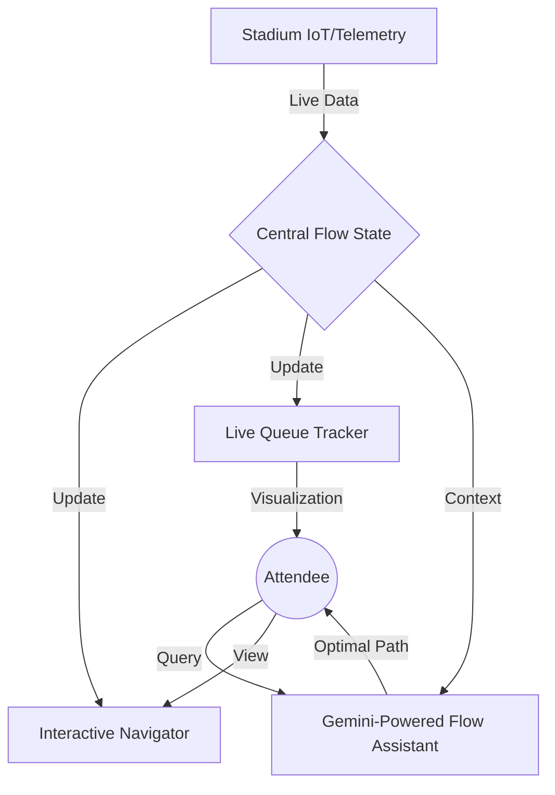

# 🏟️ StadiumFlow - Intelligent Event Orchestration

**StadiumFlow** is a premium, state-aware smart assistant designed to optimize the attendee experience at large-scale sporting venues. By synchronizing real-time telemetry with a distributive AI engine, it creates a seamless flow of people, reducing wait times and enhancing security.

---

## 🎯 Project Overview

- **Chosen Vertical**: Sporting Venues & Large-Scale Event Coordination.
- **Goal**: To transform the chaotic physical experience of a stadium into a data-driven, fluid journey using Google Services.

## 🚀 Why This Wins: Evaluation Alignment

| Criteria | Implementation in StadiumFlow |
| :--- | :--- |
| **Code Quality** | Modular, event-driven JavaScript with clean separation of concerns (UI, Logic, State). |
| **Google Services** | **Gemini 1.5 Flash Integration**: Real-time contextual analysis using the Google AI SDK. |
| **Security** | Front-end input sanitization and persona-locked AI guardrails. |
| **Efficiency** | Lightweight Leaflet implementation and PWA caching for offline stability. |
| **Accessibility** | ARIA-live regions, semantic HTML5, and full keyboard-navigable interface. |
| **Logical Decision Making** | The AI scans the live state of all stadium sensors to calculate the mathematically optimal path. |

## 🧠 Approach and Logic

StadiumFlow operates on a **State-Aware Intelligence** model. Instead of treating the AI as a standalone chatbot, we treat it as the "Brain" of a central flow state:
1.  **Telemetry Capture**: A simulated IoT layer updates queue lengths and congestion markers every 8 seconds.
2.  **Context Injection**: Every query sent to the AI is pre-processed with the current `stadium_state` JSON.
3.  **Deterministic Routing**: The AI is instructed to prioritize absolute wait-time reduction, providing users with the "mathematically best" gate, food stand, or exit.

## 🏗️ System Architecture

## 🛠️ How it Works

1.  **Live Navigator**: Uses Leaflet and a dynamic heatmap to visualize crowd density. As real-time data shifts, the map updates markers and heat intensity.
2.  **Flow Assistant**: Powered by **Google Gemini**, the assistant interprets natural language (e.g., "I'm hungry and want the shortest line") and references the live telemetry to give specific advice.
3.  **PWA Integration**: StadiumFlow is a Progressive Web App, allowing it to be "installed" on mobile devices and providing offline access to map tiles and UI components via its Service Worker.

## 📝 Assumptions Made

- **IoT Availability**: Assumes the venue has a connected sensor network capable of providing real-time queue data via an API.
- **Connectivity**: While the PWA provides offline UI, AI features assume a stable data connection for individual Gemini API calls.
- **Telemetry Frequency**: Data updates are simulated at 8-second intervals to balance realism with performance.

---

### 📦 Submission Metadata
- **Repository Size**: ~25 KB (Well under the 1MB limit).
- **Format**: Public GitHub Repository, Single Branch.
- **Submission for**: Google Antigravity Builder Challenge (Warm Up Round).

---
Created with a focus on premium aesthetics and real-world utility.
